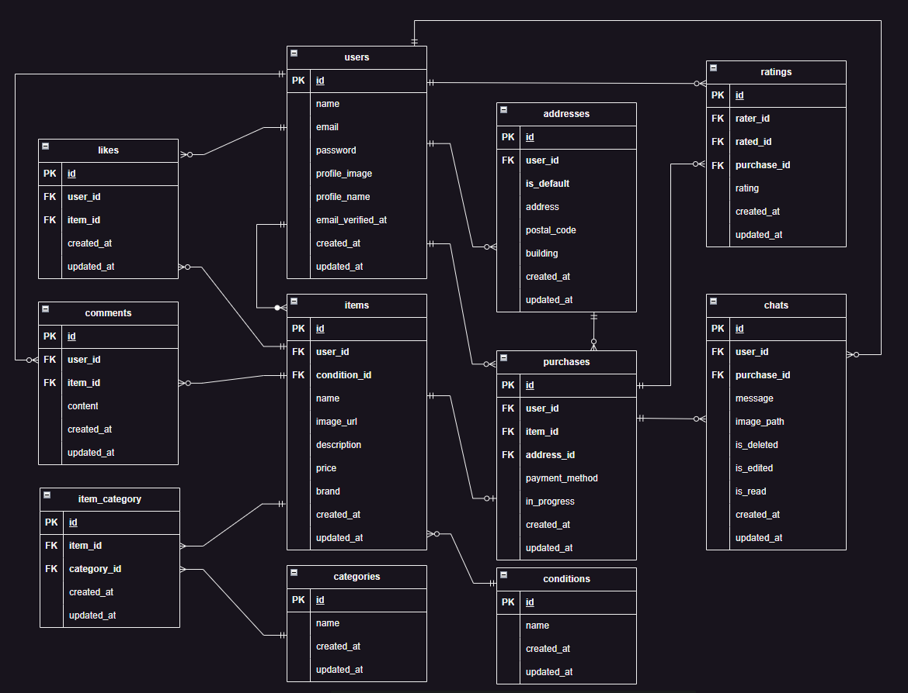

# COACHTECH フリマアプリ

## 環境構築

ここでは、COACHTECH フリマアプリをクローンし、ローカル環境で動作させるための手順を説明します。

---

### 1. プロジェクトをクローン

#### 【目的】

GitHub のリポジトリからプロジェクトをローカル環境にコピーします。

#### 【手順】

1. ターミナルで、クローンしたいディレクトリに移動します。
   ```bash
   cd /path/to/your/desired/directory
   ```
2. 以下のコマンドを実行してリポジトリをクローンします。

   ```bash
   git clone git@github.com:Gerol-steiner/20250212_resale-app_pro.git

   ```

3. クローンしたディレクトリに移動します（必要であればディレクトリ名を変更）
   ```bash
   cd 20250212_resale-app_pro
   ```

### 2. Docker でコンテナを起動

#### 【目的】

アプリケーションの実行に必要な PHP、MySQL、phpMyAdmin、Nginx などを Docker で立ち上げます。

#### 【手順】

1. 以下のコマンドを実行してコンテナを構築・起動します。
   ```bash
   docker-compose up -d --build
   ```
2. 起動後、コンテナが正常に起動していることを確認します。
   ```bash
   docker ps
   ```
3. 以下のコンテナが動作していることを確認してください。

- PHP
- MySQL
- Nginx
- phpMyAdmin

### 3. 「.env」ファイルの設定

#### 【目的】

環境変数を定義するための`.env`ファイルを作成し、設定を適用します。

#### 【手順】

1. PHP コンテナ内に入ります。
   ```bash
   docker-compose exec php bash
   ```
2. `.env.example`ファイルをコピーして`.env`ファイルを作成します。
   ```bash
   cp .env.example .env
   ```
3. `.env`ファイルに必要な情報を入力します。

- `DB_`セクションにデータベースの情報を入力。
  ```bash
  DB_DATABASE=laravel_db
  DB_USERNAME=laravel_user
  DB_PASSWORD=laravel_pass
  ```
- `MAIL_`セクションにメール設定を入力。
  ```bash
  MAIL_USERNAME=（各自設定）
  MAIL_PASSWORD=（各自設定）
  MAIL_FROM_ADDRESS=（各自設定）
  ```
- `STRIPE_`セクションに Stripe の公開キーと秘密キーを入力。

  ```bash
  STRIPE_PUBLISHABLE_KEY=（各自設定）
  STRIPE_SECRET_KEY=（各自設定）

  ```

4. 補足：php コンテナから退出したいときは、以下のコマンドで退出します。
   ```bash
   exit
   ```

### 4. Composer パッケージのインストール

#### 【目的】

アプリケーションで必要なライブラリやパッケージをインストールします。

#### 【手順】

1. PHP コンテナ内に入ります。

   ```bash
   docker-compose exec php bash

   ```

2. コンテナ内で以下のコマンドを実行します。
   ```bash
   composer install
   ```

### 5. アプリケーションキーの生成

#### 【目的】

アプリケーションの暗号化キーを生成します。

#### 【手順】

1. PHP コンテナ内に入ります。

   ```bash
   docker-compose exec php bash

   ```

2. コンテナ内で以下のコマンドを実行します。
   ```bash
   php artisan key:generate
   ```

- `.env`ファイルの`APP_KEY`が生成されていることを確認してください。
- `APP_KEY`が生成されていないときは、`.env`ファイルを閉じた状態で手順「2.」を再度実行してください。

### 6. ダミーデータ用の商品画像を移動（またはコピー）

#### 【目的】

シードデータに対応する商品画像を適切な場所に配置します。  
（下記方法は一例であり、各自適切な方法で画像をコピーまたは移動してください）

#### 【手順】

1. 必要に応じ、PHP コンテナから退出します。

   ```bash
   exit

   ```

2. ”コンテナ外” で以下のコマンドを実行します。
   ```bash
   cp -r src/public/images/uploads src/storage/app/public/
   ```

### 7. ストレージリンクの作成

#### 【目的】

ストレージディレクトリをパブリックディレクトリにリンクして、Web で画像を参照できるようにします。

#### 【手順】

1. PHP コンテナ内に入ります。

   ```bash
   docker-compose exec php bash

   ```

2. コンテナ内で以下のコマンドを実行します。
   ```bash
   php artisan storage:link
   ```

### 8. ストレージ権限の付与

#### 【目的】

アプリケーションが`storage`ディレクトリにアクセスできるようにします。  
（以下はあくまでも一例です。権限のエラーが発生したら状況に合わせ適切に対処してください。）

#### 【手順】

■ Linux 環境の場合:

1. PHP コンテナ内に入ります。

   ```bash
   docker-compose exec php bash

   ```

2. コンテナ内で以下のコマンドを実行します。
   ```bash
   chmod -R 775 storage
   chown -R www-data:www-data storage
   ```

■ その他の環境（Windows、macOS）の場合:

- ファイルシステムの GUI を使用するか、環境に応じた適切な方法で storage ディレクトリとその中のファイルに対して、Web サーバーが読み取り/書き込みできるように権限を設定してください。
- 具体的な方法は OS やサーバー設定によって異なるため、必要に応じてシステム管理者に相談するか、お使いの環境のドキュメントを参照してください。

※ 注意: 権限設定は適切なセキュリティを維持しつつ、アプリケーションが正常に動作するように行ってください。

### 9. データベースの準備

#### 【目的】

アプリケーションで使用するデータベースを構築します。

#### 【手順】

1. PHP コンテナ内に入ります。

   ```bash
   docker-compose exec php bash

   ```

2. コンテナ内で以下のコマンドを実行してマイグレーションを実行します。

   ```bash
   php artisan migrate

   ```

3. ダミーデータを作成します。
   ```bash
   php artisan db:seed
   ```

### ＜注意事項＞

1. 商品画像やプロフィール画像: 商品やプロフィール画像が正しい場所に配置されていない場合、アプリケーションが正常に動作しません。必ずダミーデータの画像を storage/app/public/uploads に移動してください。
2. 権限の付与: 特に storage ディレクトリへの書き込み権限が不足している場合、エラーが発生します。権限設定を確実に行ってください。
3. 環境依存: 上記の手順は Linux を想定しています。Windows や Mac の場合、コマンドが異なる場合がありますので適宜環境に合わせて調整してください。

---

### 【ダミーデータの内容】

- ダミーデータとしてユーザーが **3 人**、商品が **10 個** 作成されます。
- ユーザーは **全てメール認証済みユーザー** として作成されます。
- ユーザーのログインパスワードは **"password"** に統一されています。
- 作成されるダミー商品は以下の通りです。

| 商品 ID | 商品名           | 価格   | 商品説明                               | コンディション       |
| ------- | ---------------- | ------ | -------------------------------------- | -------------------- |
| CO01    | 腕時計           | 15,000 | スタイリッシュなデザインのメンズ腕時計 | 良好                 |
| CO02    | HDD              | 5,000  | 高速で信頼性の高いハードディスク       | 目立った傷や汚れなし |
| CO03    | 玉ねぎ 3 束      | 300    | 新鮮な玉ねぎ 3 束のセット              | やや傷や汚れあり     |
| CO04    | 革靴             | 4,000  | クラシックなデザインの革靴             | 状態が悪い           |
| CO05    | ノート PC        | 45,000 | 高性能なノートパソコン                 | 良好                 |
| CO06    | マイク           | 8,000  | 高音質のレコーディング用マイク         | 目立った傷や汚れなし |
| CO07    | ショルダーバッグ | 3,500  | おしゃれなショルダーバッグ             | やや傷や汚れあり     |
| CO08    | タンブラー       | 500    | 使いやすいタンブラー                   | 状態が悪い           |
| CO09    | コーヒーミル     | 4,000  | 手動のコーヒーミル                     | 良好                 |
| CO10    | メイクセット     | 2,500  | 便利なメイクアップセット               | 目立った傷や汚れなし |

- CO01 ～ CO05 は id=1 のユーザーの出品商品です。
- CO06 ～ CO10 は id=2 のユーザーの出品商品です。
- id=3 のユーザーは出品商品なしです。

---

## テスト環境と実行手順

テスト用のデータベースを準備し、プロジェクトのテストを適切に実行できる環境を整えます。

### 1. テスト用データベースの作成

#### 目的

テスト用データベースを作成して、テスト実行時に使用できるようにする。

#### 手順

1. MySQL コンテナに入る  
   以下のコマンドで MySQL コンテナに接続します:

```bash
docker-compose exec mysql bash
```

2. MySQL にログイン  
   コンテナ内で以下を実行して MySQL にログインします:

```bash
mysql -u root -p
```

※ パスワードは `docker-compose.yml` で設定した `MYSQL_ROOT_PASSWORD` を入力してください（例: `root`）。

3. テスト用データベースの作成  
   以下のコマンドでデータベースを作成します:

```bash
CREATE DATABASE demo_test; -- テーブル名は変更しないでください
SHOW DATABASES; -- 作成したデータベースが表示されれば成功
```

4. 権限の付与

   以下のコマンドを実行して、`laravel_user` に `demo_test`テーブル へのアクセス権を付与します:

```bash
GRANT ALL PRIVILEGES ON demo_test.* TO 'laravel_user'@'%';
```

権限変更を適用するために次のコマンドを実行します:

```bash
FLUSH PRIVILEGES;
```

5. ログアウトおよびコンテナ退出  
   以下を実行して MySQL からログアウトし、コンテナを退出します:

```bash
exit; -- MySQLログアウト
exit; -- コンテナから退出
```

---

### 2. テスト用環境設定

#### 目的

`.env.testing` を作成して、テスト用環境を設定する。

#### 手順

1. `.env.testing` を作成  
   PHP コンテナ内で以下を実行します:

```bash
cp .env .env.testing
```

3. `.env.testing` の設定  
   必要に応じて以下を編集します:

```bash
APP_ENV=testing
APP_KEY=  # 空のままにしてください
DB_CONNECTION=mysql
DB_HOST=mysql
DB_PORT=3306
DB_DATABASE=demo_test  # 先ほど作成したデータベース名
DB_USERNAME=laravel_user  # docker-compose.ymlで設定した値
DB_PASSWORD=laravel_pass  # docker-compose.ymlで設定した値
```

5. アプリケーションキーの生成  
   以下のコマンドを実行してテスト用環境のキーを生成します:

```bash
php artisan key:generate --env=testing
```

7. 設定キャッシュのクリア（必要に応じて）  
   `.env.testing` の変更が反映されない場合に以下を実行してください:

```bash
php artisan config:clear
```

---

### 3. テスト用マイグレーション

#### 目的

テスト用データベースにテーブルを作成する。

#### 手順

PHP コンテナ内で以下のコマンドを実行しテーブルを作成します:

```bash
php artisan migrate --env=testing
```

---

### 4. テストの実行

#### 目的

プロジェクトの機能が期待通り動作するか確認する。

#### 手順

以下のいずれかのコマンドを使用してテストを実行します:

```bash
php artisan test
```

または、PHPUnit を直接使用する場合:

```bash
vendor/bin/phpunit
```

**Docker 環境で実行する場合**  
PHP コンテナ内で以下を実行してください:

```bash
docker-compose exec php bash
php artisan test
```

---

### 補足

- **`phpunit.xml` の設定について**  
  `phpunit.xml` はプロジェクトに既に含まれているため、基本的に編集は不要です。特殊な要件がある場合のみ修正してください。

- **テストデータの準備**  
  シードファイルを使用してテストデータを準備する場合、以下のコマンドを実行してください:

```bash
php artisan db:seed --env=testing
```

---

## 使用技術（実行環境）

以下の技術を使用しています：

### **バックエンド**

- Laravel Framework: 8.75
- PHP: ^7.3 | ^8.0
- Stripe SDK: ^16.2
- Laravel Fortify: ^1.19
- Laravel Sanctum: ^2.11
- Laravel UI: ^3.4
- Laravel Tinker: ^2.5

### **フロントエンド**

- Bootstrap: ^5.1.3
- Axios: ^0.21
- Laravel Mix: ^6.0.6
- Sass: ^1.32.11

### **その他**

- MySQL: 8.0.26 (Docker 公式イメージを使用)
- Nginx: 1.21.1 (Docker 公式イメージを使用)
- Composer: 2.8.1
- Docker: バージョンに依存せず最新の公式イメージを想定

---

## データベース設計

以下は本アプリケーションで使用しているデータベースの ER 図です。



---

## アプリケーション URL 一覧

### ユーザー向け主要画面

- 開発環境トップページ: [http://localhost/](http://localhost/)
- ユーザー登録: [http://localhost/register](http://localhost/register)
- ログイン: [http://localhost/login](http://localhost/login)
- マイページ: [http://localhost/mypage](http://localhost/mypage)
- プロフィール編集: [http://localhost/mypage/profile](http://localhost/mypage/profile)
- 商品一覧: [http://localhost/](http://localhost/)
- 商品詳細: [http://localhost/item/{item_id}](http://localhost/item/{item_id})
- 商品購入: [http://localhost/purchase/{id}](http://localhost/purchase/{id})
- 出品ページ: [http://localhost/sell](http://localhost/sell)
- いいね機能: [POST] [http://localhost/like/{item_id}](http://localhost/like/{item_id})
- コメント機能: [POST] [http://localhost/item/{item_id}/comments](http://localhost/item/{item_id}/comments)

### チャット機能

- 取引チャット画面の表示: [http://localhost/transaction-chat/{item_id}](http://localhost/transaction-chat/{item_id})
- メッセージの送信: [POST] [http://localhost/chat/send](http://localhost/chat/send)
- メッセージの削除: [POST] [http://localhost/chat/delete](http://localhost/chat/delete)
- メッセージの編集: [POST] [http://localhost/chat/edit](http://localhost/chat/edit)
- メッセージの取得（ポーリング用）: [GET] [http://localhost/chat/get-messages](http://localhost/chat/get-messages)
- 取引完了の処理: [POST] [http://localhost/transaction/complete](http://localhost/transaction/complete)

### 評価機能

- 取引相手の評価登録: [POST] [http://localhost/transaction/rate](http://localhost/transaction/rate)

### 購入・配送関連

- 商品購入ページ（初回）: [http://localhost/purchase/{id}](http://localhost/purchase/{id})
- 商品購入ページ（住所変更後の遷移）: [http://localhost/purchase/{id}](http://localhost/purchase/{id})
- 配送先住所の変更: [http://localhost/purchase/address/{item_id}](http://localhost/purchase/address/{item_id})
- 配送先住所の更新: [POST] [http://localhost/address/update](http://localhost/address/update)

### 決済機能（Stripe）

- チェックアウトセッション作成: [POST] [http://localhost/create-checkout-session](http://localhost/create-checkout-session)
- 決済成功後のリダイレクト: [http://localhost/purchase/success](http://localhost/purchase/success)
- コンビニ支払い後の Thanks ページ: [http://localhost/showthanks](http://localhost/showthanks)
- 購入完了ページ: [http://localhost/purchase-complete](http://localhost/purchase-complete)

### メール認証関連

- メール認証待ちページ: [http://localhost/register/pending](http://localhost/register/pending)
- メール認証リクエスト: [GET] [http://localhost/email/verify/{id}/{hash}](http://localhost/email/verify/{id}/{hash})

### 認証関連

- ログイン: [POST] [http://localhost/login](http://localhost/login)
- ログアウト: [POST] [http://localhost/logout](http://localhost/logout)

正確なアプリケーションのルート構成は routes/web.php に定義されています。  
必要に応じて、該当ファイルをご確認いただき、最新のルートや追加エンドポイントをご参照ください。
